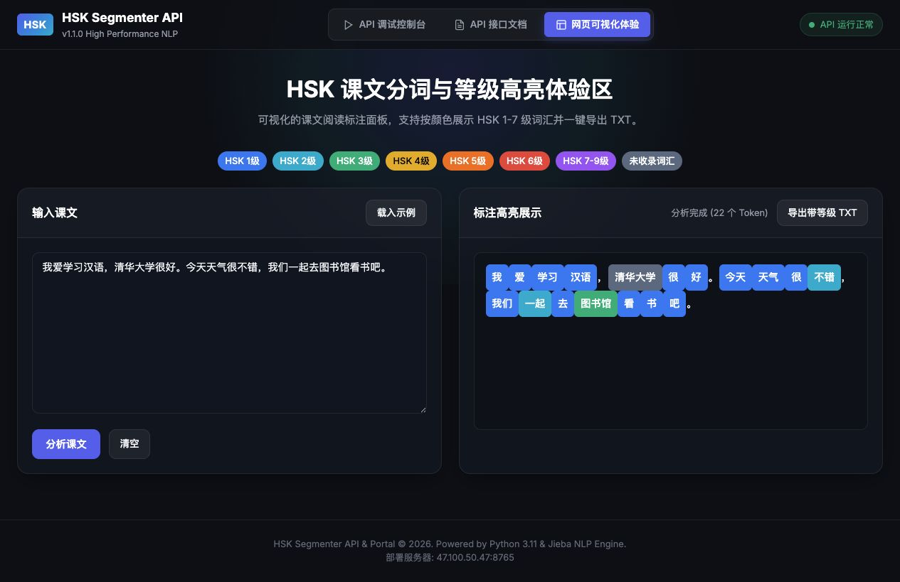

# HSK 分词工具｜现代汉语分词与等级标注 API / SDK

[](http://47.100.50.47:8765/)
[](https://opensource.org/licenses/MIT)

[English Version](README.md) | **简体中文**

本仓库提供一套面向中文学习者、教师、内容创作者和 NLP 开发者的 **HSK 分词工具**，也是 **HSK 现代汉语分词与等级标注云端 API 服务** 的官方轻量级客户端 SDK 与接入文档。

支持在 Python、JavaScript、Node.js 及 cURL 中快速对中文文本进行分词，并自动标注各个词汇对应的 HSK 1–9 级等级、汉语拼音及词性。

- **在线 API 调试控制台 & 体验**: [http://47.100.50.47:8765/](http://47.100.50.47:8765/)
- **API 基地址**: `http://47.100.50.47:8765`

## 🔎 主要功能

- **中文分词 / 现代汉语分词**：处理句子、课文、阅读材料和中文语料。
- **HSK 词汇等级标注**：覆盖 HSK 1–6 级及 7–9 级高级词汇。
- **拼音标注与词性分析**：输出拼音、词性和结构化 Token 数据。
- **中文 NLP REST API**：提供 Python SDK、JavaScript SDK、Node.js 和 cURL 示例。
- 基于 **Jieba**，适用于 HSK 学习、中文教学、分级阅读和词汇难度分析。

## ✨ 在线体验效果

无需编写代码：粘贴一段中文课文，即可看到分词结果以及按颜色区分的 HSK 词汇等级。点击下图可打开在线体验页面。

[](http://47.100.50.47:8765/)

> 示例覆盖 HSK 1–6 级及 7–9 级词汇，包括“参观、人工智能、倡议、共识”等不同难度的词；页面同时支持查看拼音和导出带等级的 TXT 文本。

---

## 🚀 快速开始

### 1. Python 调用示例

使用本仓库提供的 `hsk_client.py` 模块：

```python
from hsk_client import HskClient

# 初始化客户端（传入您的 API Key）
client = HskClient(api_key="YOUR_API_KEY")

# 1. 快捷分词与 HSK 等级标注
res = client.segment("周末，我和朋友参观了城市博物馆。")
print(res["result"])
# 输出结果: 周末[3]，我[1]和[1/7-9]朋友[1]参观[4]了[1]城市[3]博物馆[5]。

# 2. 结构化详细词汇分析（含拼音与词性）
data = client.analyze("今天天气很不错。")
for token in data["tokens"]:
    if token["kind"] == "word":
        print(f"{token['text']} | 等级: {token.get('display_level')} | 拼音: {token.get('pinyin')}")
```

---

### 2. cURL 命令行调用

```bash
curl -X POST http://47.100.50.47:8765/api/segment \
     -H "X-API-Key: YOUR_API_KEY" \
     -H "Content-Type: application/json" \
     -d '{"text": "周末，我和朋友参观了城市博物馆。"}'
```

---

### 3. JavaScript / Fetch (Web 前端 & 微信小程序)

```javascript
fetch('http://47.100.50.47:8765/api/segment', {
  method: 'POST',
  headers: {
    'X-API-Key': 'YOUR_API_KEY',
    'Content-Type': 'application/json'
  },
  body: JSON.stringify({ text: '周末，我和朋友参观了城市博物馆。' })
})
.then(res => res.json())
.then(data => console.log(data.result));
// 输出: 周末[3]，我[1]和[1/7-9]朋友[1]参观[4]了[1]城市[3]博物馆[5]。
```

---

## 📡 API 接口规范说明

| 端点 (Endpoint) | HTTP 方法 | 鉴权要求 | 接口说明 |
| :--- | :--- | :--- | :--- |
| `/api/health` | `GET` | 否 (公开) | 服务健康检查接口 |
| `/api/segment` | `POST` | 是 (`X-API-Key`) | 快捷分词并返回带等级标记的文本（格式：`词语[等级]`） |
| `/api/analyze` | `POST` | 是 (`X-API-Key`) | 返回完整结构化 JSON（含分词、HSK 等级、拼音、词性） |

---

## 🛡️ 安全与频控规范

- **身份鉴权**：正式 API 请求需在 Header 中携带 `X-API-Key: 您的密钥`。请勿将密钥放入 URL 或前端源码。
- **请求限流**：针对单 IP 限制每分钟最多 60 次请求，超过返回 `HTTP 429`。
- **文本上限**：单次分析请求的文本长度上限为 **10,000 字符**。

---

## 📄 开源协议

[MIT License](LICENSE)
